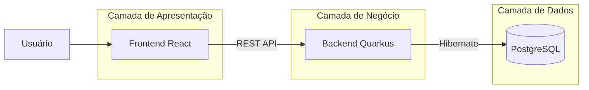

# 🏭 AutoFlex Inventory Management

> **Sistema Completo de Gestão de Estoque e Produção Industrial**

Bem-vindo ao **AutoFlex**, uma solução moderna para indústrias que buscam eficiência no controle de matérias-primas e otimização da produção. O sistema gerencia todo o ciclo de vida do produto, desde o cadastro de insumos até a **sugestão inteligente de fabricação** baseada no estoque disponível e lucratividade.

---

## 📋 Descrição do Projeto

Este projeto foi desenvolvido como um desafio técnico completo, demonstrando habilidades em **Full Stack Development**. Ele resolve o problema de calcular "o que produzir hoje?" com base nos ingredientes que você tem na prateleira.

### ✨ O que o sistema faz?

1.  **Gerencia Estoque**: Controla quantidades de matérias-primas.
2.  **Define Receitas**: Cria a composição técnica de cada produto.
3.  **Sugere Produção**: Um algoritmo analisa o estoque e diz: _"Com o que temos, você pode produzir X unidades do Produto A e lucrar R$ Y."_
4.  **Dashboard**: Visão clara de todos os indicadores.

---

## 🏗️ Arquitetura do Sistema

O projeto segue o padrão de microserviços/SPA, dividido em dois grandes módulos.



### 📚 Documentação Detalhada por Módulo

Para não sobrecarregar este arquivo, criamos manuais detalhados para cada parte do sistema:

| Módulo       | Descrição                                      | Link                                                    |
| :----------- | :--------------------------------------------- | :------------------------------------------------------ |
| **Backend**  | API REST, Endpoints, Banco de Dados e Quarkus. | [📖 Ler Documentação do Backend](./backend/README.md)   |
| **Frontend** | Interface, Componentes, Redux e React.         | [📖 Ler Documentação do Frontend](./frontend/README.md) |

---

## ✅ Checklist do MVP

Funcionalidades entregues nesta versão:

- [x] **Cadastro de Produtos**: CRUD completo (Criar, Ler, Atualizar, Deletar).
- [x] **Controle de Matérias-Primas**: Gestão de estoque de insumos.
- [x] **Composição de Produtos**: Vínculo N:N entre Produtos e Matérias-Primas (Receitas).
- [x] **Sugestão de Produção**: Algoritmo de cálculo de produção viável.
- [x] **Dashboard Interativo**: Telas responsivas com React.
- [x] **Testes Automatizados**: Fluxos principais cobertos com Cypress.

---

## 🚀 Guia Rápido: Como Rodar (Passo a Passo)

Siga este guia para ter o projeto rodando em menos de 5 minutos.

### Pré-requisitos

- **Docker** (Instalado e rodando)
- **Node.js** (v18+)
- **Java** (JDK 17+)

### 1️⃣ Clonar o Projeto

```bash
git clone https://github.com/carlosresendeP/projeto-autoflex.git
cd projeto-autoflex
```

### 2️⃣ Subir o Banco de Dados (Docker)

Não precisa instalar o Postgres na sua máquina, apenas rode o container:

```bash
docker run --name autoflex-db -e POSTGRES_PASSWORD=postgres -e POSTGRES_USER=postgres -e POSTGRES_DB=autoflex -p 5432:5432 -d postgres
```

### 3️⃣ Iniciar o Backend

Em um terminal, acesse a pasta `backend` e inicie o servidor Quarkus:

```bash
cd backend
quarkus dev
```

_Aguarde até ver "Profile dev activated"._

### 4️⃣ Iniciar o Frontend

Em **outro terminal**, acesse a pasta `frontend` e inicie o React:

```bash
cd frontend
npm install
npm run dev
```

_Acesse o sistema em: http://localhost:5173_

---

## ❓ Dúvidas e Decisões de Projeto

### Por que Quarkus no Backend?

Escolhi o Quarkus pela sua **velocidade de inicialização** e baixo consumo de memória ("Supersonic Subatomic Java"), ideal para arquiteturas modernas e cloud-native. Além disso, o padrão **Panache** simplifica drasticamente a camada de persistência (Hibernate).

### Por que Postgres no Docker?

Para garantir que **qualquer desenvolvedor** consiga rodar o projeto sem poluir sua máquina instalando bancos de dados locais. O container garante que todos usem a mesma versão e configuração do banco.

### Redux vs Context API?

Optei pelo **Redux Toolkit** devido à necessidade de compartilhar o estado de "Produtos" e "Matérias-Primas" entre várias telas diferentes (Sugestão, Listagem, Edição). O Redux centraliza essa lógica e evita refetching desnecessário dos dados.

---

## 📝 Licença

Desenvolvido por **Carlos Resende** para fins de estudo e portfólio.
