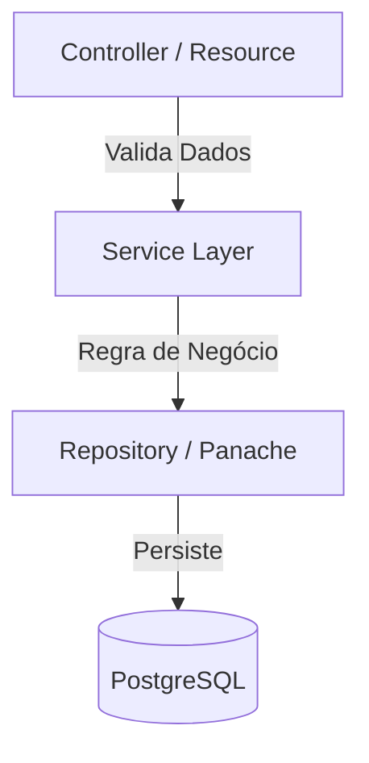

# 🧠 Backend do AutoFlex: A Inteligência do Controle

> **Documentação Técnica para Desenvolvedores Backend**

Bem-vindo à documentação oficial da API do **AutoFlex**. Aqui você encontrará tudo o que precisa para entender, executar e estender a camada de servidor desta aplicação.

---

## 🏗️ Arquitetura Clean e SOLID

Nosso backend foi construído com foco em **separation of concerns** (separação de responsabilidades). Seguimos um padrão de camadas bem definido:



### 📂 Onde as coisas vivem?

| Pacote                   | Responsabilidade                                                | Exemplo                        |
| :----------------------- | :-------------------------------------------------------------- | :----------------------------- |
| `com.autoflex.resources` | **Endpoints da API**. Recebem requisições HTTP e retornam JSON. | `ProductResource.java`         |
| `com.autoflex.services`  | **Regras de Negócio**. Calculam sugestões, validam estoques.    | `ProductionService.java`       |
| `com.autoflex.models`    | **Entidades JPA**. Mapeiam as tabelas do banco de dados.        | `Product.java`                 |
| `com.autoflex.dto`       | **DTOs**. Objetos de transferência de dados (Responses).        | `ProductionSuggestionDTO.java` |

---

## 🔌 API Reference (Endpoints)

Todas as requisições e respostas são formatadas em **JSON**.

### 1. Produtos

Gerencie o catálogo de itens finais.

#### **listar todos** (`GET /products`)

```json
// Resposta 200 OK
[
  {
    "id": 1,
    "name": "Mesa de Jantar",
    "value": 450.0
  },
  {
    "id": 2,
    "name": "Cadeira",
    "value": 120.0
  }
]
```

#### **Criar Novo** (`POST /products`)

```json
// Corpo da Requisição
{
  "name": "Estante de Livros",
  "value": 300.5
}
```

---

### 2. Matérias-Primas

Controle o estoque de insumos.

#### **Listar Todas** (`GET /materials`)

```json
// Resposta 200 OK
[
  {
    "id": 10,
    "name": "Madeira (m²)",
    "stockQuantity": 500
  },
  {
    "id": 11,
    "name": "Parafusos",
    "stockQuantity": 2000
  }
]
```

#### **Atualizar Estoque** (`PUT /materials/{id}`)

Para dar entrada ou saída de material, atualize a quantidade.

```json
// Corpo da Requisição
{
  "stockQuantity": 450 // Nova quantidade total
}
```

---

### 3. Sugestão de Produção (`GET /production/suggestion`)

O endpoint mais inteligente do sistema. Ele calcula o que produzir.

**Como funciona?**

1.  Busca todas as receitas.
2.  Verifica o estoque atual de cada ingrediente.
3.  Retorna uma lista ordenada pelo **Valor Total de Venda**.

```json
// Resposta 200 OK
[
  {
    "productName": "Mesa de Jantar",
    "possibleQuantity": 5, // Podemos fazer 5 mesas com o estoque atual
    "totalValue": 2250.0 // (5 * 450.00)
  },
  {
    "productName": "Cadeira",
    "possibleQuantity": 20,
    "totalValue": 2400.0
  }
]
```

---

## ⚙️ Configuração (application.properties)

As configurações do Quarkus ficam em `src/main/resources/application.properties`.

### Conexão com Banco de Dados

```properties
# Em Produção (usando variáveis de ambiente)
quarkus.datasource.jdbc.url=${DB_URL}
quarkus.datasource.username=${DB_USER}
quarkus.datasource.password=${DB_PASS}

# Em Desenvolvimento (Dev Services - Automático)
# O Quarkus sobe um Testcontainer automaticamente se não configurar nada!
```

---

## 🛠️ Comandos Úteis

### Rodar Migrations (Se houver Flyway)

```bash
./mvnw clean compile quarkus:dev
```

### Debugar

O Quarkus habilita debug na porta **5005** por padrão. Configure sua IDE para "Remote JVM Debug" nesta porta.
